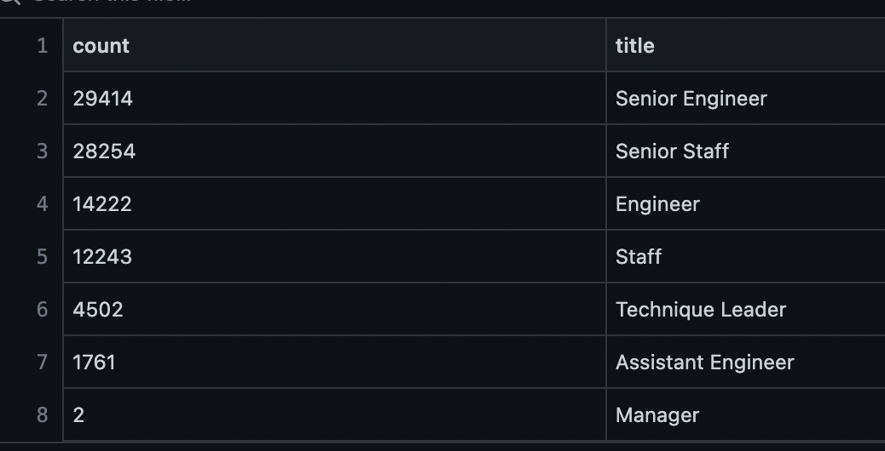
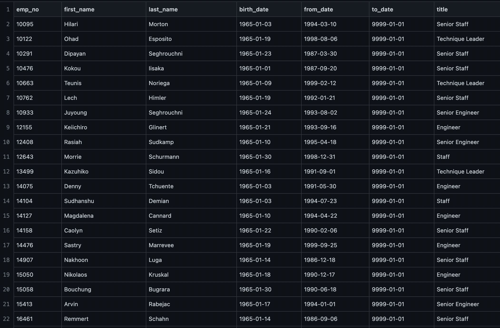
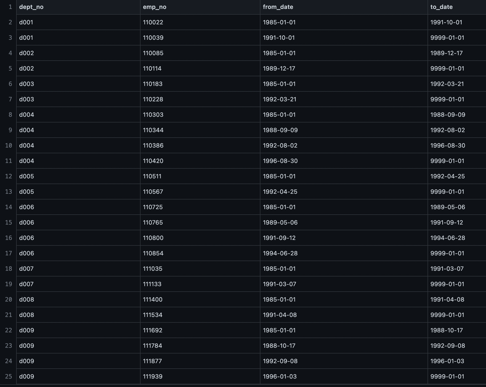
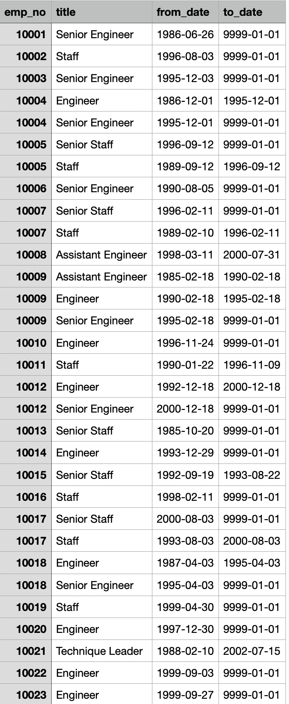

# Pewlett-Hackard-Analysis

## Overview
In this analysis, we discovered the total amount of employees leaving the company, narrowed down to the most recent title they've held, as well as established who among them would be eligible to participate in a mentorship program to help train their replacements.

## Results
The results from the analysis are:
* Among the retiring employees, many hold senior positions, such as Senior Engineer.
* Of those retiring titles, only two are held by managers.
* Many of these employees have moved up through the ranks of the company over the years, showing loyalty to a well-managed company with corresponding benefits and it would behoove to continue to foster this, especially in the mentorship program.
* Many of the retirees are in a good position to mentor, as a common title among the list is "Technique Leader", showing that they have experience learning information and then disseminating it to lower levels of staff.

## Summary
The total number of employees retiring is: 90,398. This is made up of senior engineers, senior staff, engineers, staff, technique leaders, assistant engineers, and managers. 

This would require an equavalent number to be hired and/or promoted on to replace in each department.
Between every department and position held by a soon to be retiree, there are 1,549 people eligible to participate in the mentorship program.

The above provides a small sample of the available employees for the mentorship program. As listed, many provide senior positions, or positions that would require regular education and teaching opportunites.
Please also see the provided table listing all current department managers to choose from to potentially replace the two retiring, the majority of whom who have been with the company for years and no doubt have a plethora of experience to draw from to fill their predecessors shoes.

Please also see a list of titles held by employees in the company, many of whom hold senior or assistant positions able to be moved up in the company.

